# 🥊 월피 (Wallet Fight)

글로벌 화폐를 보관할 수 있는 ‘월렛’ 서비스에 캐릭터 육성 게이미피케이션 요소를 추가한 프로젝트

 

# 💡프로젝트 설명

- 해당 프로젝트는 게이미피케이션 요소를 통한 신규 사용자의 금융 서비스 유입을 목적으로 합니다.
- 월피의 월렛 서비스는 여러 외화를 하나의 계좌에서 통합적으로 관리할 수 있게 합니다.
- 월피의 게임은 크게 캐릭터 육성 그리고 배틀로 이루어져 있습니다.

 

# 👉 월피 서비스 화면

## 회원 가입 및 로그인
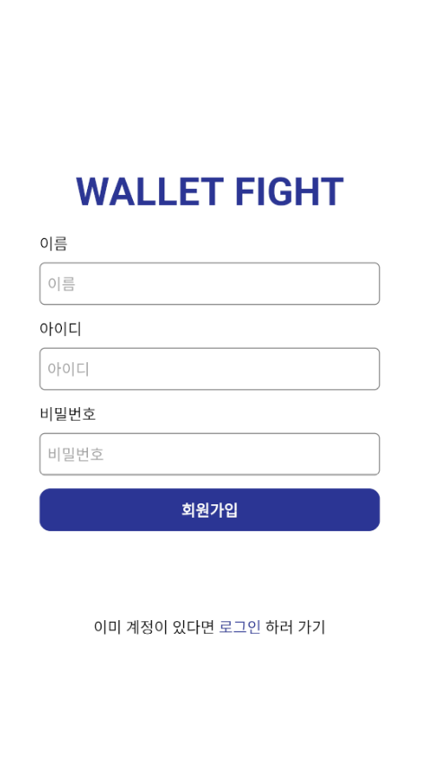 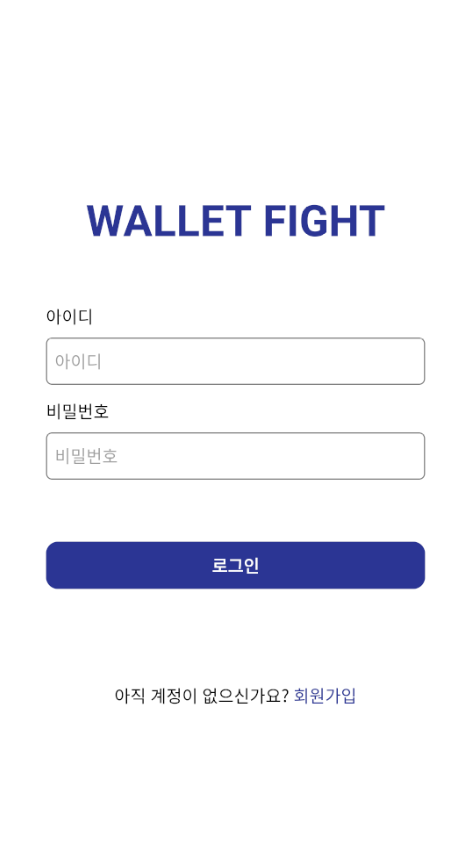

## 뱅킹 서비스
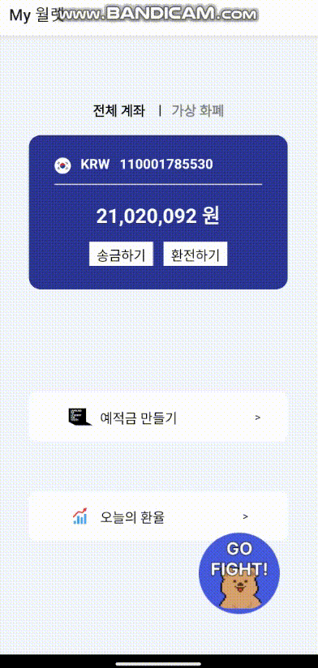   
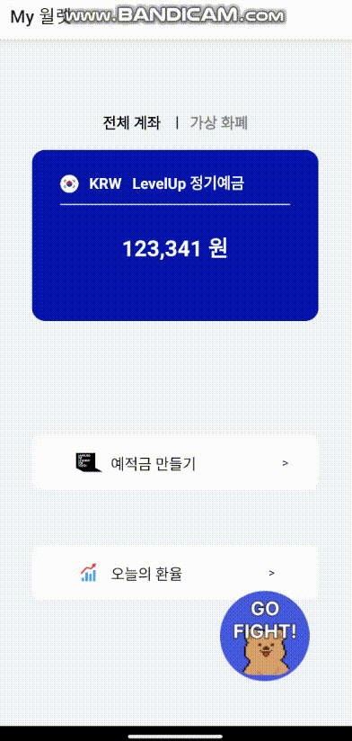 

## 게임 서비스
 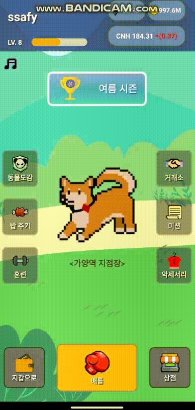 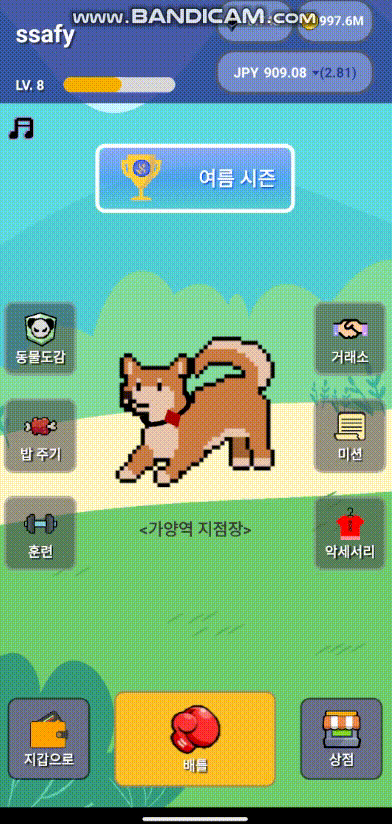 
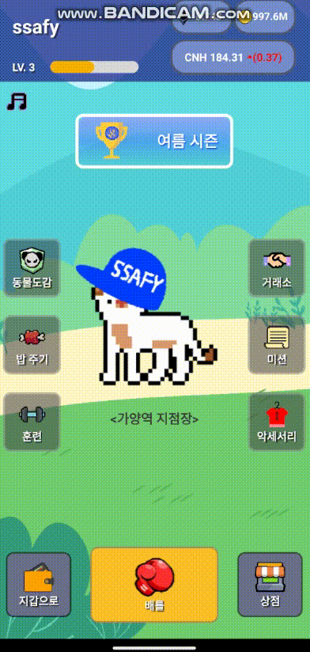  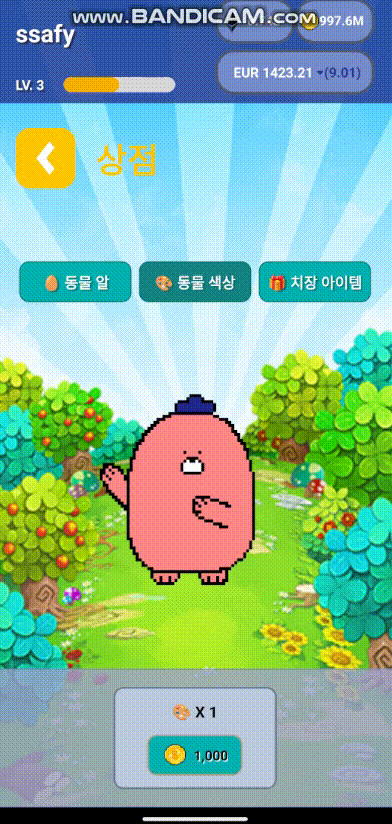 
 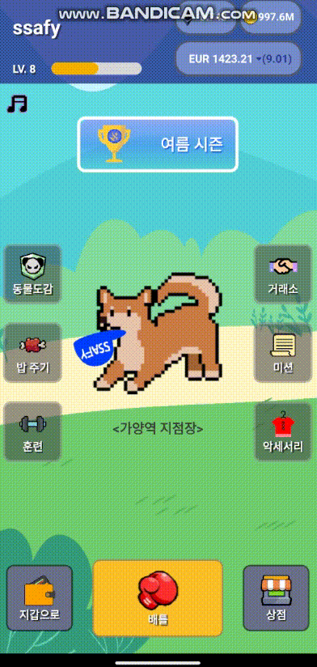 

## 🖥️ 개발 환경

### 🛠 **Backend**
- Spring Boot
- MySql
- Redis
- JWT
- Spring Security
- NodeJS

### 🛠 **Frontend**
- Visual Studio Code 
- React.js 18.2.0 
- react-bootstrap 2.8.0 
- Material-UI 
- redux-toolkit 1.9.5 
- redux 8.1.1

### 🛠 **CI/CD**
- aws ec2
- docker
- jenkins
- mettermost

## 🧱 서비스 아키텍처
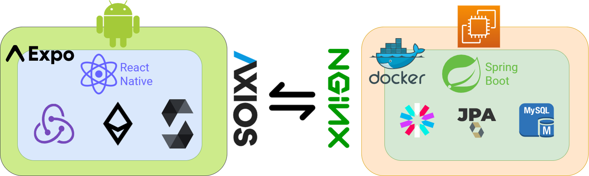

## ❗ 기술 특이점
- Spring Scheduler
   > - Spring Scheduler를 이용해 특정 시간에 반복적인 작업을 하도록 하여 퀘스트, 금융상품, 게임 등을 설계했습니다.

- 이더리움 거래
   > - nonce와 보낼 ether, 현재 필요한 gas 당 wei, credential을 이용해 이더 송금
- 자체 코인 생성
  > - erc20 규약에 맞춰 solidity로 코드 작성 후 배포, 월피 코인 생성

## ✨ ER Diagram
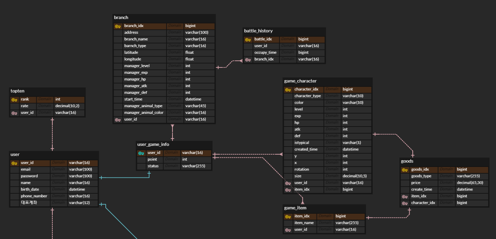
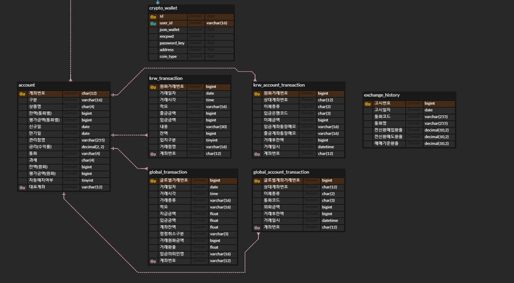

## 😃 팀원 소개

|Back end|Back end|Back end|Front end|Front end|Front end|
| :-: | :-: | :-: | :-: | :-: | :-: |
|  |  |  |  |  | 
|김민수(팀장)|진희솜|김유정|김수민|박민아|서지호|
