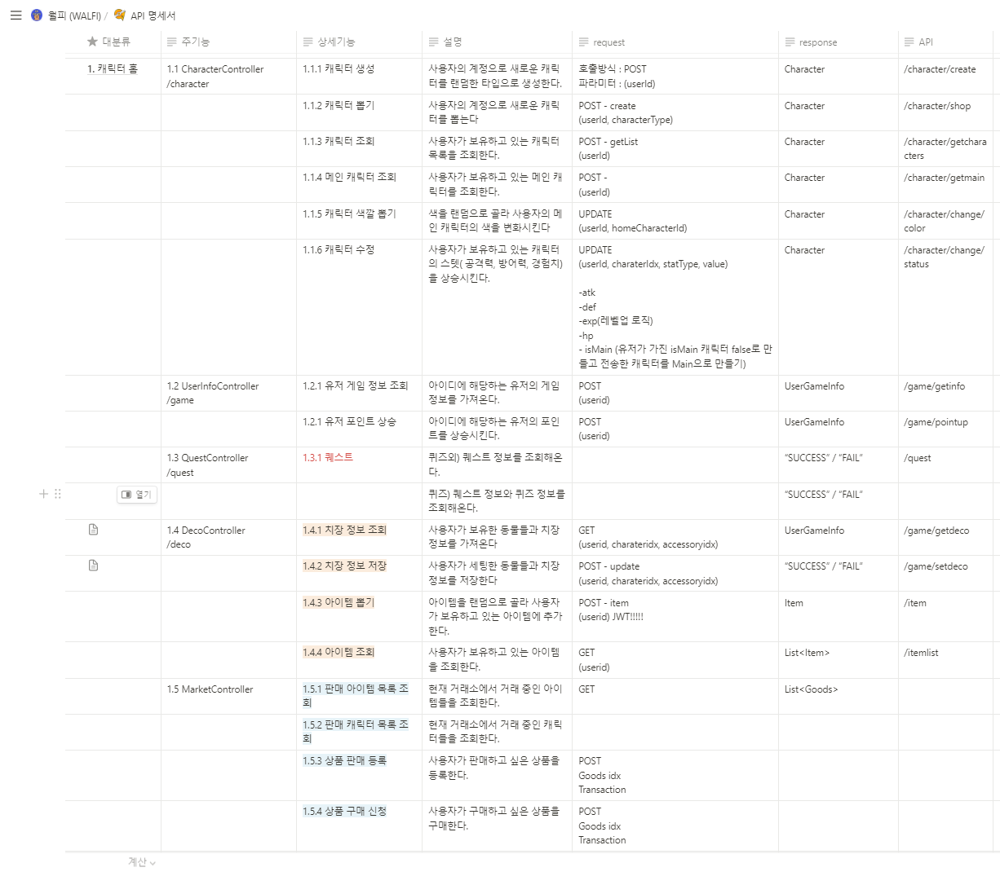
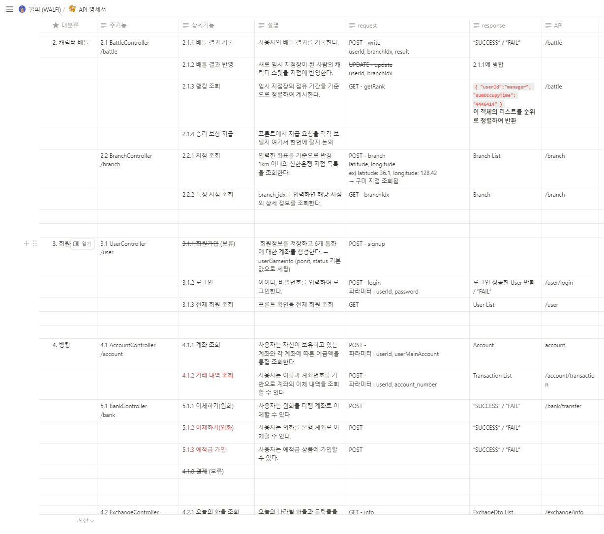

# 🥊 월피 (Wallet Fight)

글로벌 화폐를 보관할 수 있는 ‘월렛’ 서비스에 캐릭터 육성 게이미피케이션 요소를 추가한 프로젝트

<br>

## 💡프로젝트 설명

- 해당 프로젝트는 게이미피케이션 요소를 통한 신규 사용자의 금융 서비스 유입을 목적으로 합니다.
- 월피의 월렛 서비스는 여러 외화를 하나의 계좌에서 통합적으로 관리할 수 있게 합니다.
- 월피의 게임은 크게 캐릭터 육성 그리고 배틀로 이루어져 있습니다.

<br>

---

<br>

- ## 📅 프로젝트 기간 - 2023.08.21 ~ 2021.10.06

- ## 👉 월피 서비스 화면

- ### 회원관리

  1. 회원가입
     
  2. 로그인
     

- ### 뱅킹 서비스

  1. 송금
     
  2. 예적금 만들기
     
  3. 이더리움 송금
     
  4. 환율 조회
     
  5. 환전
     

- ### 게임 서비스

  1. 게임 홈
     
  2. 밥 먹이기
     
  3. 훈련하기
     
  4. 알뽑기
     
  5. 아이템 뽑기
     
  6. 색상 뽑기
     
  7. 치장
     
  8. 판매
     
  9. 전투
     

- ## 🖥️ 개발 환경

---

- 🛠 **Backend**

  - Spring Boot
  - MySql
  - Redis
  - JWT
  - Spring Security
  - NodeJS

- 🛠 **Frontend**
  !!!!!!!!!!!!수정필요 - Visual Studio Code - React.js 18.2.0 - react-bootstrap 2.8.0 - Material-UI - redux-toolkit 1.9.5 - redux 8.1.1

- 🛠 **CI/CD**
  - aws ec2
  - docker
  - jenkins
  - mettermost

### 🧱 서비스 아키텍처

---


### ❗ 기술 특이점

---

- Spring Scheduler

  > - Spring Scheduler를 이용해 특정 시간에 반복적인 작업을 하도록 하여 퀘스트, 금융상품, 게임 등을 설계했습니다.

- 이더리움 거래

  > - nonce와 보낼 ether, 현재 필요한 gas 당 wei, credential을 이용해 이더 송금

- 자체 코인 생성
  > - erc20 규약에 맞춰 solidity로 코드 작성 후 배포, 월피 코인 생성

### 👨‍👩‍👧 협업 툴

---

- Git
- Jira
- Notion
- Mattermost
- Webex

### API 명세서

---




### ✨코드 컨벤션

---

```
### 함수, 변수명

- 함수
    - 첫번째는 동사로
    - numOfSockets 하지 말고 numberOfSockets
- 변수 → 명사
- INT A, B, C 하지 말기
- 카멜 케이스

### SQL

- * 쓰지 말고 다 써주기
- from member면 첫머리 따기 m으로

### Exception

- Exception Handler가 일괄적으로 Exception 처리 후 ResponseEntity로 반환
-

### if {}, for {}

- 한줄이어도 if() {
- } 이렇게 쓰기

### Lombok

- @Data 쓰지 말기

### return Arguments

- return new A() 쓰지말고
- A a = new A()
- return a 쓰기

### 패키지명 컨벤션

- domain
- controller
- service
- mapper (마이바티스), repository(JPA)
- config → 설정파일
- dto
```

### ✨Git 컨벤션

---

#### Commit 컨벤션

| Type       | Desc                                                   |
| ---------- | ------------------------------------------------------ |
| [기능]     | 새로운 기능 구현                                       |
| [버그]     | 오류 수정                                              |
| [문서]     | ReadME, JSON 파일 등 수정, 라이브러리 설치 (문서 관련) |
| [리팩토링] | 코드 Refactoring                                       |
| [스타일]   | 코드에 변화가 없는 수정 (세미콜론 등)                  |
| [설정]     | 빌드 부분 혹은 패키지 매니저 수정 사항                 |
| [파일]     | 파일 혹은 폴더 명 수정, 옮기기, 파일 삭제              |

- **변경 사항의 유형** 중 하나를 나타내는 역할
- **태그**와 **제목**으로 구성

#### PR 컨벤션

- PR #숫자 [시작 브랜치 → 목적 브랜치]

```jsx
PR #2 [domain-heesom -> domain]
```

### 💡Git Flow 브랜치 전략

---

- Git Flow model을 사용하고, Git 기본 명령어 사용한다.

- Git Flow 사용 브랜치

- Git Flow 진행 방식

### 👨‍👩‍👧 Jira

---

협업 및 일정, 업무 관리를 위해 Jira를 이용하였습니다. 매주 월요일 오전 회의에서 한 주동안 진행되어야 할 주 단위 계획을 짜고, 진행할 이슈들을 스프린트를 만들어 등록했습니다. 스프린트는 일주일 단위로 진행하였습니다.

### 👨‍👩‍👧 Notion

---

모두가 봐야할 공지, 함께 공부해야 할 링크 등을 모아 관리했습니다. 회의 기록 및 의견들은 항상 추가하고 복기 할 수 있게 하였고, 공통으로 보아야하는 컨벤션 및 스케쥴 할일 등은 날짜별로 볼 수 있도록 정리하였습니다.

### ✨ ER Diagram

---


### 😃 팀원 역할

---

- **팀장 김민수 [BE]**

  - 팀장으로서 직권 남용

- **진희솜 [BE]**

  - 젠킨스를 활용한 CI/CD 구축 (빌드시 채팅 알림)
  - 게임 관련 백엔드 API
  - 환전 기능, 금융 상품 개설
  - 스케줄러를 활용하여 만기에 해당하는 계좌 처리
  - 자체 가상화폐 계좌 생성, 자체 코인 발행 (Ethereum 기반)
  - 가상화폐 송금 (Ethereum)

- **김유정 [BE]**

  - 게임, 환율 API 개발
  - 데이터베이스 설계 및 관리
  - 도트 캐릭터 제작

- **박민아 [FE]**

  - 월렛 ui/ux,
  - 월렛 기능 개발,
  - 회원 관리

- **서지호 [FE]**

  - 게임 배틀 ui / ux
  - 게임 배틀 기능
  - 치장 ui / ux
  - 치장 기능
  - 지도 기능 (Google Map API)
  - Reactotron -> RN 디버깅
  - 앱 빌드, 배포 FAIL

- **김수민 [FE]**
  - 게임 홈, 상점, 거래소, 캐릭터 도감 UI/UX 및 개발
  - 게임 상점 뽑기 기능 개발
  - 게임 거래소 아이템 구매 / 판매 기능 개발
