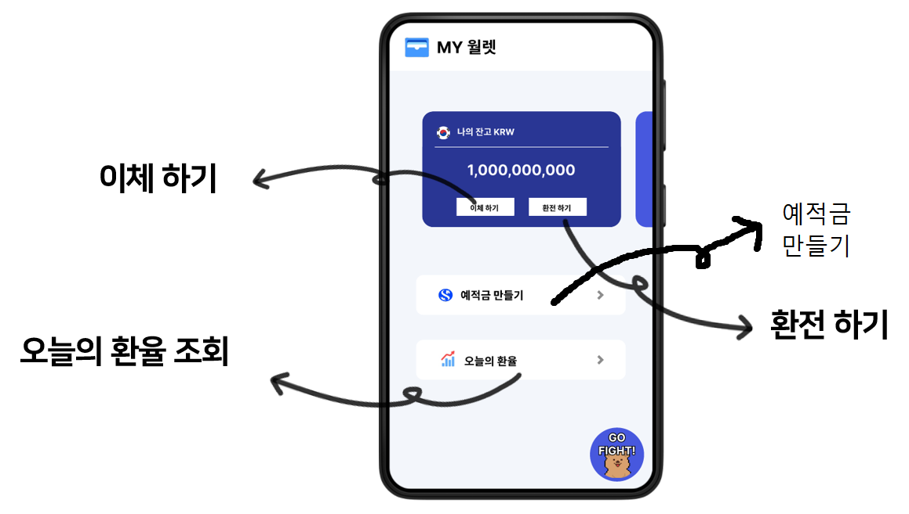
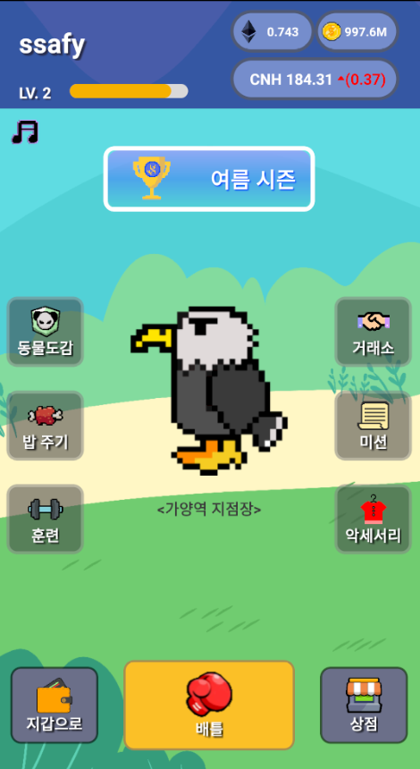

## Build Info

### Frontend

- 더욱 자세한 사항은 `frontend` 폴더에 `package.json` 파일을 확인해주세요.

|     Name     | Version |
| :----------: | :-----: |
|     expo     | 49.0.8  |
| react-native | 0.72.5  |
|    Redux     |  4.2.1  |
|    VSCode    |    -    |

### Backend

|   Name   |        Version        |
| :------: | :-------------------: |
|   JVM    |   OpenJDK 11.0.20.1   |
|  Docker  | 24.0.6, build ed223bc |
| Intellij |        2023.02        |
| Jenkins  |        2.414.1        |

## Build

### Front

```
1. npm install --global yarn
2. yarn add package.json
3. yarn expo start
```

### Backend

```
1. ./gradlew clean build
2. java -jar Build된 파일 경로
```

## DB Dump File

- `Dump Folder`를 확인해주세요.

# 시연 시나리오

## 1. 금융 서비스



## 2. 게임 서비스


